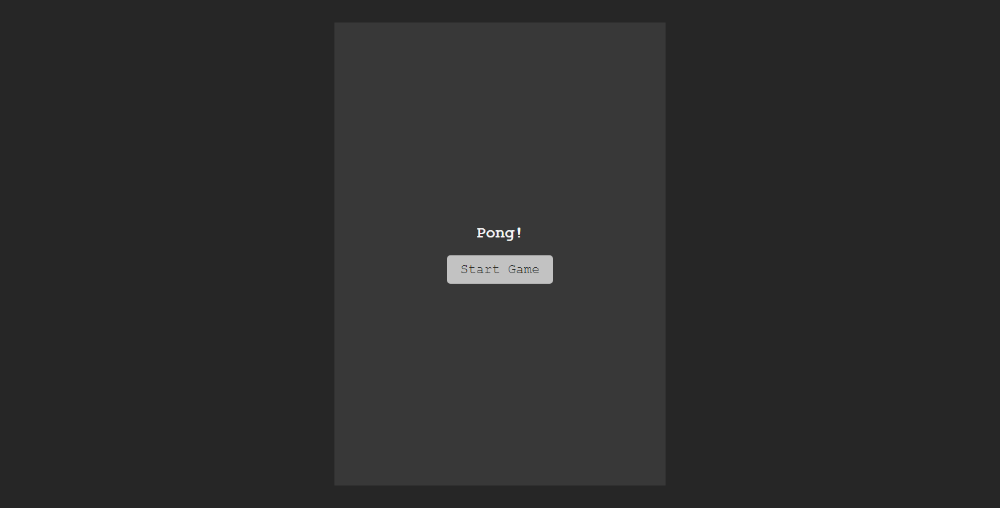
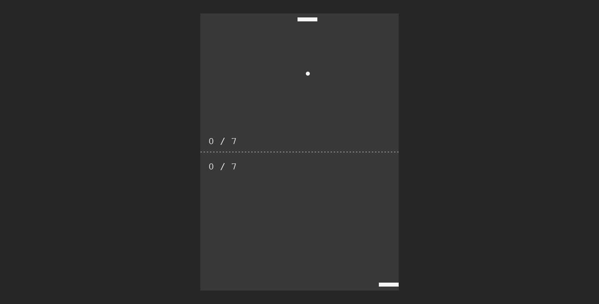
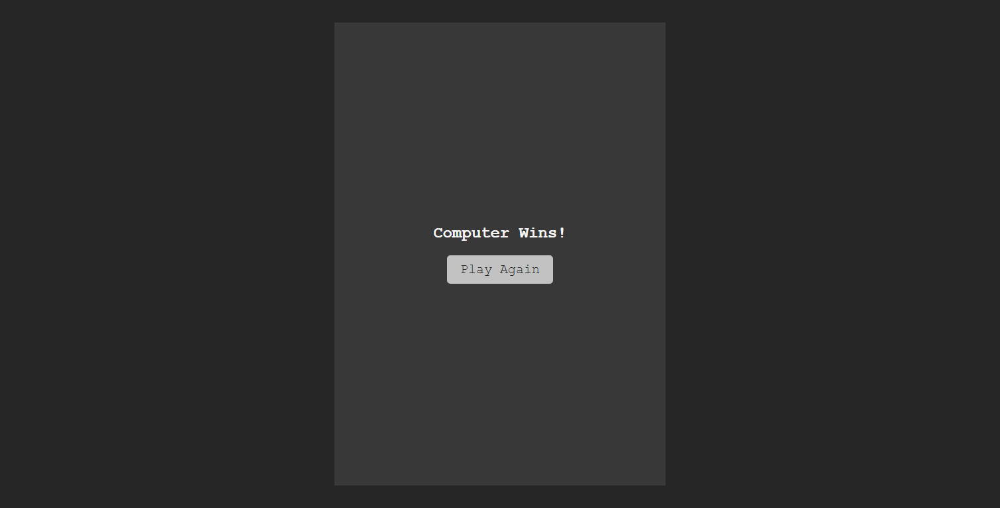

# HSBC Assignment #2: Javascript

This is the solution of HSBC Assignment #2: Javascript. In this assignment, students were asked to build a web page that has javascript application. Regarding that, this project is trying to apply javascript usage by creating a Pong game.

## Table of contents

- [Overview](#overview)
  - [The challenge](#the-challenge)
  - [App Features](#app-features)
  - [Screenshot](#screenshot)
  - [Links](#links)
- [My process](#my-process)
  - [Built with](#built-with)
  - [What I learned](#what-i-learned)
  - [Useful resources](#useful-resources)

## Overview

### The challenge

1. Apply javascript in a web page

### App features

1. See start game/ play again UI
2. See game over UI
3. Play different audio based on the event that happened:
    1. Start game
    2. Ball bouncing
    3. Any player conceded a goal
    4. Player wins
    5. Computer wins
4. Move player paddle using mouse inside the arena
5. Move computer paddle by itself when detecting x location of the ball is changed

### Screenshot

<table>
 <tr>
   <th colspan="3"><strong>Desktop</strong></th>
 </tr>
 <tr>
   <td></td>
   <td></td>
   <td></td>
 <tr>
   <th colspan="3"><strong>Mobile</strong></th>
 </tr>
 <tr>
   <td></td>
   <td></td>
   <td></td>
 </tr>
</table>

### Links

- [Github repo](https://github.com/nurmarief/hsbc-assignment-2-js/)
- [Live site](https://nurmarief.github.io/hsbc-assignment-2-js/)

## My process

### Built with

- Semantic HTML5 markup
- CSS
- Javascript

### What I Learned
1. Animation using javascript with
```
   window.requestAnimationFrame()
```
2. Draw 2d object inside HTML Canvas with CanvasRenderingContext2D
```
   HTMLCanvasElement.getContext('2d')
```
3. CanvasRenderingContext2D properties and methods
```
   // Setup style for fill object
   CanvasRenderingContext2D.fillStyle

   // Create fill rectangle
   CanvasRenderingContext2D.fillRect()

   // Create text
   CanvasRenderingContext2D.font
   CanvasRenderingContext2D.fillText

   // Create dashed lines
   CanvasRenderingContext2D.beginPath()
   CanvasRenderingContext2D.setLineDash()
   CanvasRenderingContext2D.moveTo()
   CanvasRenderingContext2D.lineTo()
   CanvasRenderingContext2D.strokeStyle
   CanvasRenderingContext2D.stroke()

   // Create fill circles
   CanvasRenderingContext2D.beginPath()
   CanvasRenderingContext2D.arc()
   CanvasRenderingContext2D.fill()
```

### Useful Resources
- [freesound.org](https://freesound.org)